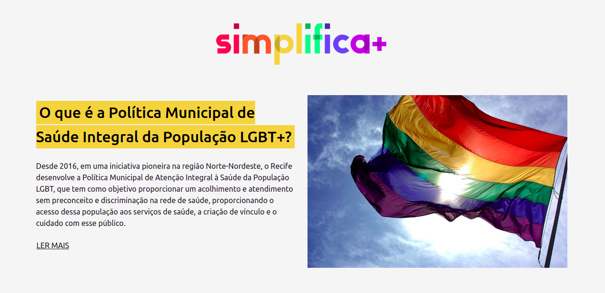
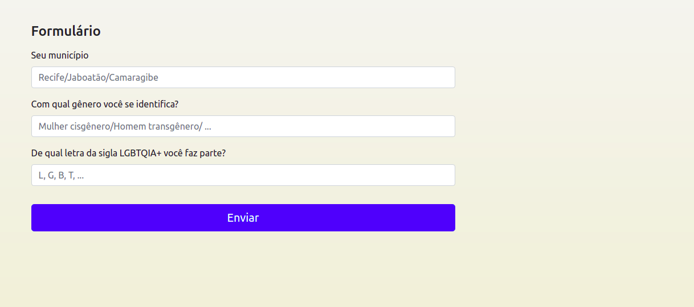
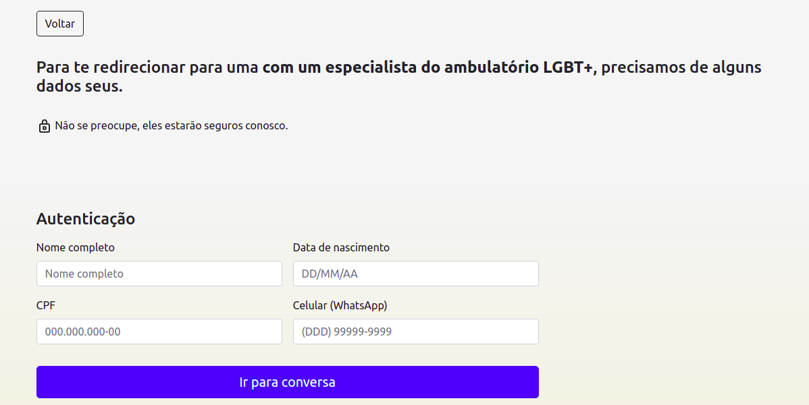
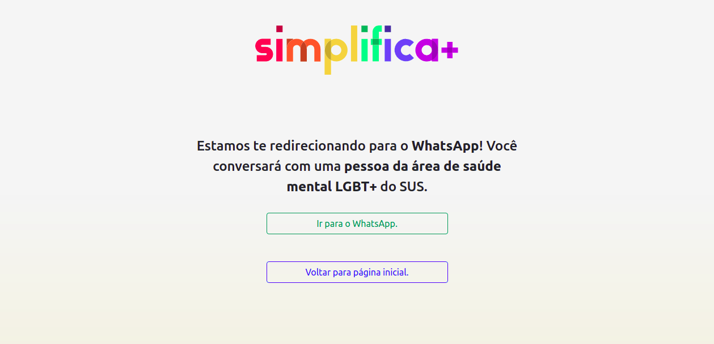

<h1 align="center">Simplifica+</h1>

  O Projeto&nbsp;&nbsp;&nbsp;|&nbsp;&nbsp;&nbsp;
  Formulários&nbsp;&nbsp;&nbsp;|&nbsp;&nbsp;&nbsp;
  Whatsapp API Link&nbsp;&nbsp;&nbsp;|&nbsp;&nbsp;&nbsp;
  Figma&nbsp;&nbsp;&nbsp;|&nbsp;&nbsp;&nbsp;
  Tecnologias&nbsp;&nbsp;&nbsp;&nbsp;&nbsp;&nbsp;

---

## 📝 O Projeto

Este repositório foi elaborado pela equipe de ciências da computação do primeiro período 2021.1 da CESAR School na cadeira de Projetos. O grupo Simplifica+, tem como objetivo simplificar o acesso da população LGBTQIA+ da Região Metropolitana do Recife ao serviço de saúde mental do SUS durante a pandemia do novo coronavírus.

Membros de ciências da computação do grupo Simplifica+ :

[André Cavalcanti](mailto:acas2@cesar.school) [André Carvalho](https://www.linkedin.com/in/andreviniciusc/) [Anthony Kevin](mailto:akds@cesar.school)

[Lucas Gominho](https://www.linkedin.com/in/lucas-gominho-06175420b/) [João Pedro Cordeiro](mailto:jpca@cesar.school) [Matheus Desjardins](https://www.linkedin.com/in/matheusdesjardins/)

Membros de design do grupo Simplifica+ :

[Júlio de Abreu](https://www.linkedin.com/in/juliodeabreu/) [Maria Clara Castanha](https://www.linkedin.com/in/maria-clara-castanha/)

[:link: Link para o dossiê.]()

[:link: Link para a apresentação.]( )

---

## :ballot_box: Formulários

---

## :speech_balloon: Whatsapp API Link

---

## :art: Figma

[:link: Link para o protótipo de alta fidelidade.](https://www.figma.com/proto/RKbixBnK2K13RrUWjMtkYQ/[alta]-Simplifica?node-id=194%3A0&scaling=min-zoom )

---

## 💻 Tecnologias

### Ferramentas

- Visual Studio Code

- Bootstrap5 (HTML/CSS/JS)

### Linguagens

- Python

  

---

by Simplifica+

